<div align="center">
  <h1>Explainable AI-Based Glaucoma Detection using Transfer Learning, LIME and LLMs</h1>
  <p><strong>A multi-modal, interpretable AI system for glaucoma detection and clinical insight generation</strong></p>
  <p>
    <a href="#overview">Overview</a> •
    <a href="#architecture">Architecture</a> •
    <a href="#technologies">Technologies</a> •
    <a href="#project-structure">Project Structure</a> •
    <a href="#installation">Installation</a> •
    <a href="#usage">Usage</a> •
    <a href="#results">Results</a> •
    <a href="#contributing">Contributing</a> •
    <a href="#snapshots">Snapshots</a>
  </p>
</div>

---

<a name="overview"></a>
## Overview

Explainable AI-Based Glaucoma Detection leverages Transfer Learning, LIME, and LLMs to deliver accurate and interpretable glaucoma screening from fundus images.

- **LLAMA 3.2 90B Vision Model:** Analyzes LIME-based visual explanations to refine interpretability.
- **LLAMA 3.1 70B LLM:** Generates detailed textual reasoning, combining model outputs and vision insights.

**System Components:**
- <strong>Frontend:</strong> React.js-based interface for image upload and result visualization
- <strong>Backend:</strong> Express.js and FastAPI for handling predictions and hosting LLMs
- <strong>Image Analysis:</strong> Combines CNN-based classification with LIME and LLAMA models for interpretability
- <strong>Database:</strong> MongoDB stores user feedback to refine predictions

---

<a name="architecture"></a>
## Framework Architecture

1. <strong>Image Upload:</strong> Users upload fundus images for evaluation
2. <strong>Classification:</strong> Pre-trained CNN model classifies images as <em>Normal</em> or <em>Glaucoma</em>
3. <strong>LIME Explanation:</strong> Highlights critical regions influencing the model’s decision
4. <strong>Vision Model Analysis:</strong> LLAMA 3.2 90B Vision Model refines LIME heatmaps and extracts superpixel importance
5. <strong>Reasoning and Explanation:</strong> LLAMA 3.1 70B LLM generates detailed textual explanations
6. <strong>Feedback:</strong> Users can submit feedback for continuous improvement

---

<a name="technologies"></a>
## Technologies

- <strong>Frontend:</strong> React.js
- <strong>Backend:</strong> Express.js, FastAPI
- <strong>AI Models:</strong> Transfer Learning (CNN, e.g., VGG16), LIME, LLAMA 3.2 90B Vision Model, LLAMA 3.1 70B LLM
- <strong>Database:</strong> MongoDB

---

<a name="project-structure"></a>
## Project Structure

```bash
Project/
│
├── Backend_Model/                    # Backend for the machine learning model and API
│   ├── model/                        # Model-related files
│   ├── Notebooks/                    # Model Training Notebooks
│   ├── predictenv/                   # Environment setup for model predictions
│   ├── server/                       # Fast API backend for model deployment
│
├── Glaucoma-Detection-using-Transfer-Learning/  # Main application
│   ├── node_modules/                 # Node.js dependencies
│   ├── public/                       # Static files for frontend
│   ├── server/                       # Node.js and Express.js backend configuration
│   ├── server.js                     # Express.js API server entry point
│   ├── src/                          # React.js source code (frontend)
│   ├── .env                          # Environment variables for configuration
│   ├── package.json                  # NPM package configuration
│   ├── vite.config.js                # Vite configuration for frontend
│
├── Test Images/                      # Test images for model validation
│   ├── Glaucoma/                     # Images of glaucoma-affected eyes
│   └── Normal/                       # Images of normal eyes
│
├── .gitignore                        # Files to be ignored by git
└── README.md                         # Project documentation
```

---

<a name="installation"></a>
## Installation

### 1. Clone the Repository
```bash
git clone https://github.com/VaibhavDaveDev/Explainable-AI-Based-Glaucoma-Detection-using-Transfer-Learning-LIME-and-LLMs.git
cd Explainable-AI-Based-Glaucoma-Detection-using-Transfer-Learning-LIME-and-LLMs
```

### 2. Backend Setup (FastAPI)
```bash
cd Backend_Model/predictenv
pip install -r requirements.txt
```

### 3. Frontend & Express.js Backend Setup
```bash
cd ../../Glaucoma-Detection-using-Transfer-Learning
npm install
```

### 4. MongoDB Setup
- Install and start MongoDB locally, or configure a remote MongoDB instance.

### 5. Configure Environment Variables
Create a `.env` file in both `Backend_Model/server` and `Glaucoma-Detection-using-Transfer-Learning` directories. Example for Express.js backend:
```env
MONGO_URI=mongodb://localhost:27017/glaucomaDetection
PORT=5000
```

---

<a name="usage"></a>
## ▶️ Usage

### 1. Start MongoDB
Ensure MongoDB is running on your machine.

### 2. Start Backend Servers
- **Express.js:**
  ```bash
  cd ../../Glaucoma-Detection-using-Transfer-Learning
  node server.js
  ```
- **FastAPI:**
  ```bash
  cd Backend_Model/server/
  uvicorn main:app --reload
  ```

### 3. Start the Frontend
```bash
cd ../../Glaucoma-Detection-using-Transfer-Learning
npm run dev
```

Access the application at: [http://localhost:3000](http://localhost:3000)

---

<a name="results"></a>
## 📊 Results and Visualizations

- **Classification Result:** Identifies the input image as <em>Normal</em> or <em>Glaucoma</em>
- **LIME Heatmaps:** Highlights important regions in the fundus image
- **LLAMA-Enhanced Explanation:**
  - <strong>Visual Analysis (LLAMA 3.2 90B):</strong> Refines LIME outputs by identifying key superpixels and their relevance
  - <strong>Reasoning (LLAMA 3.1 70B):</strong> Provides detailed natural language explanations, offering clinical insights

### Example Workflow
1. Upload a test image (e.g., from the `Test Images` folder)
2. Receive the classification result and LIME-based visual heatmap
3. View detailed reasoning generated by the LLAMA models
4. Optionally submit feedback to improve the system

---

<a name="contributing"></a>
## 🤝 Contributing

We welcome contributions! Follow these steps:
1. Fork the repository
2. Create a new branch (`git checkout -b feature/YourFeature`)
3. Commit your changes (`git commit -m 'Add your feature'`)
4. Push to the branch (`git push origin feature/YourFeature`)
5. Open a Pull Request

---

<a name="snapshots"></a>
## 🖼️ Snapshots

Here are some snapshots of the system in action:

### Multi-Modal Framework for Glaucoma Classification and Explainable AI Integration


### Home Page
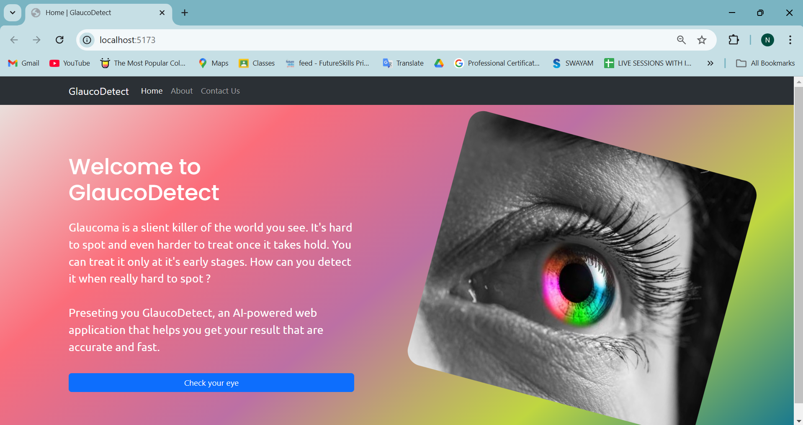

### About Page
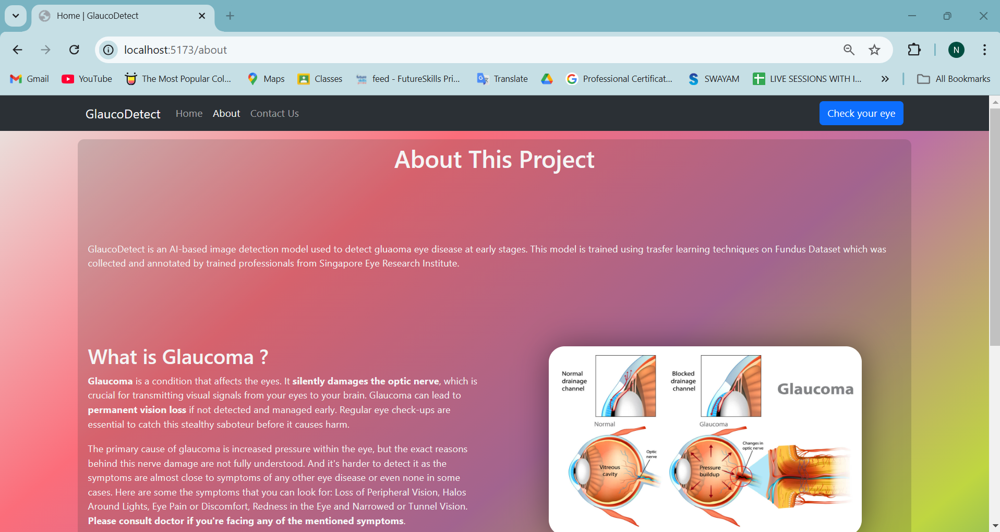

### Contact Us Page
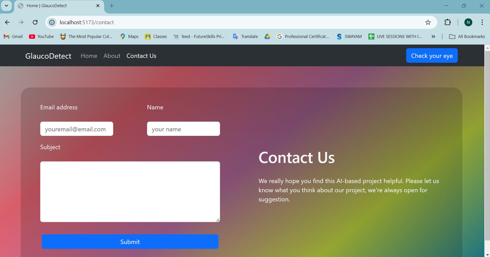

### Image Upload Interface
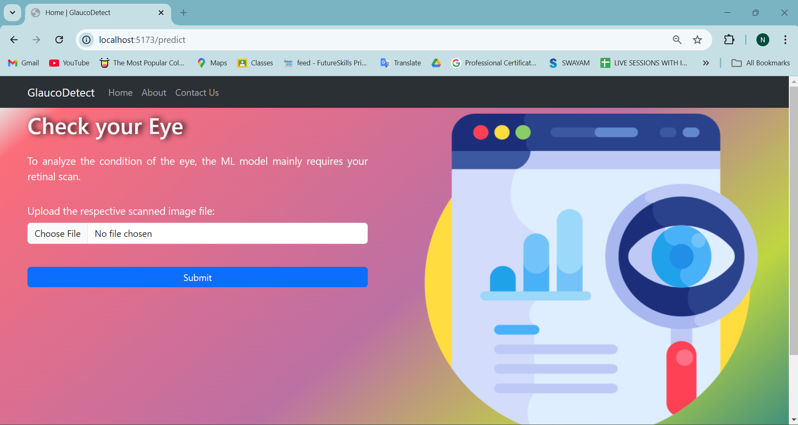

### Model Prediction and LIME Processing
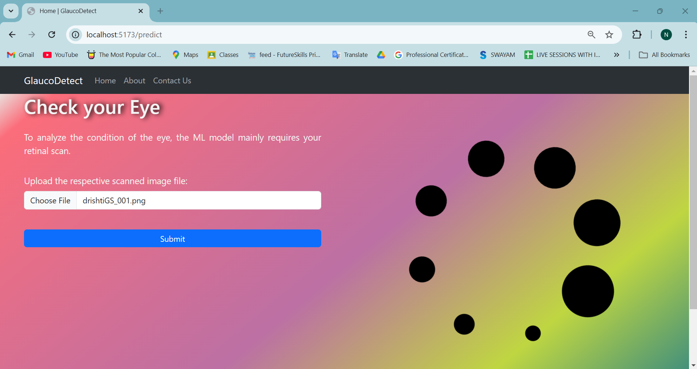

### Prediction Result
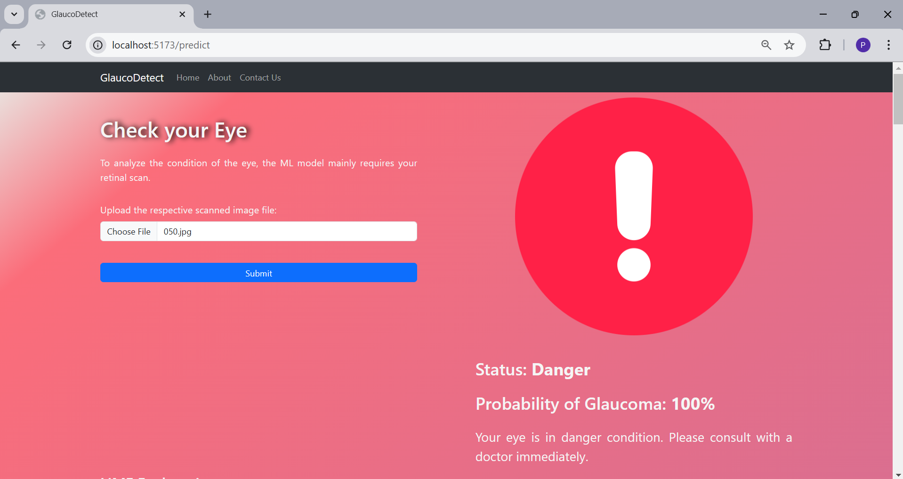

### LIME Explanation 1
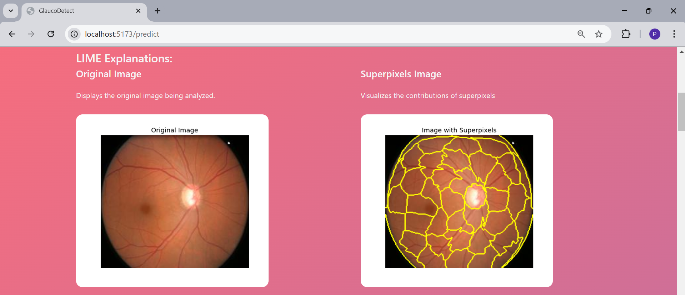

### LIME Explanation 2
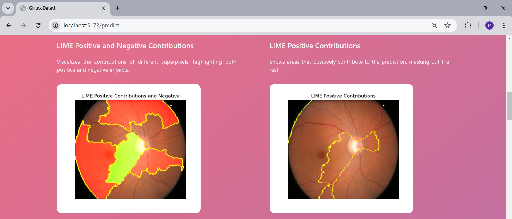

### LIME Explanation 3
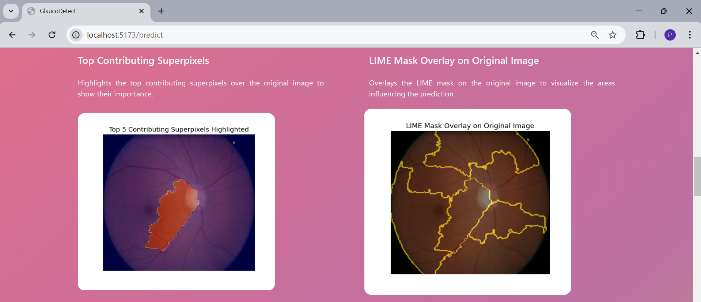

### LIME Explanation 4
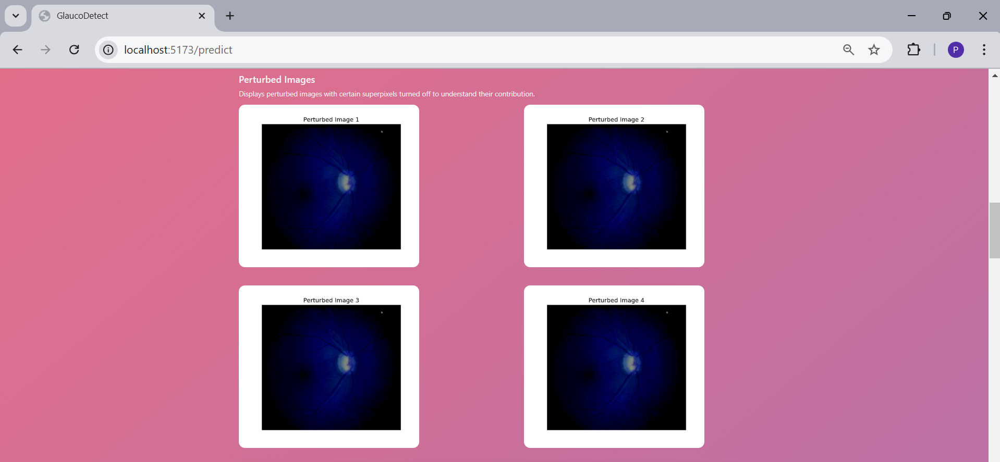

### AI Generated Explanation
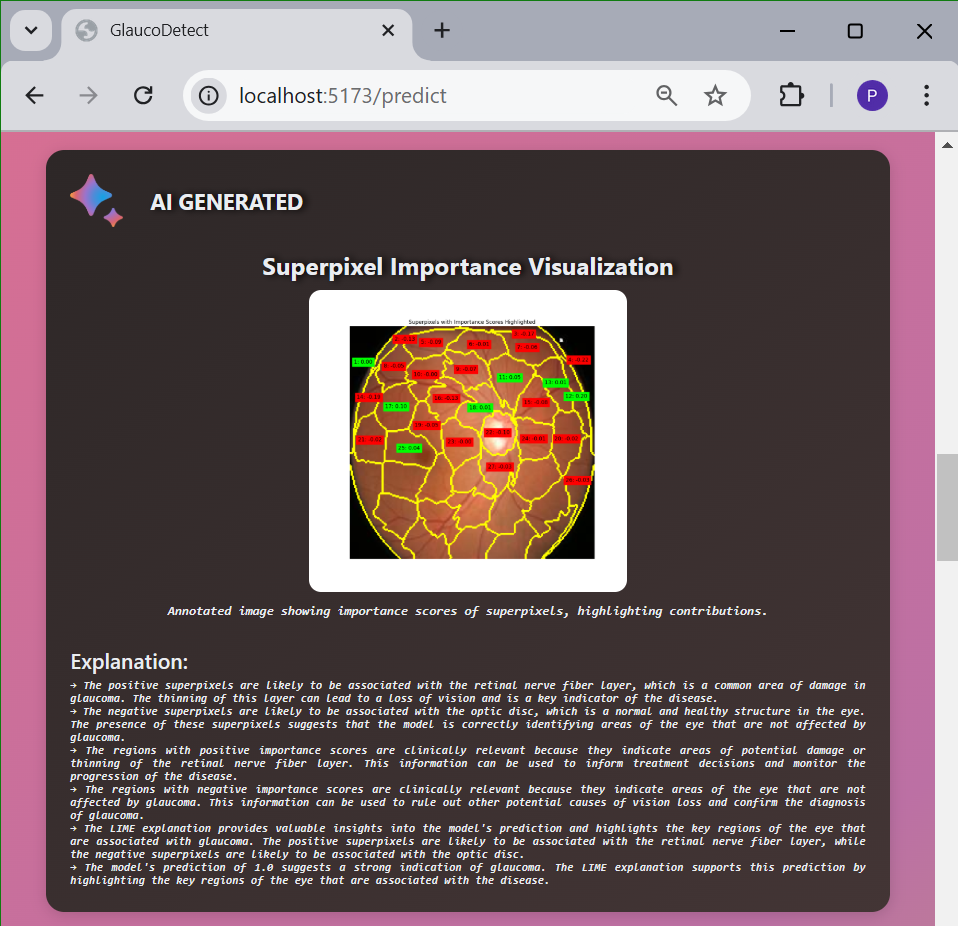

### Feedback Submission Page
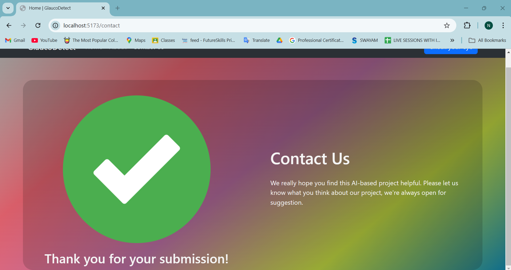

### MongoDB Database Store
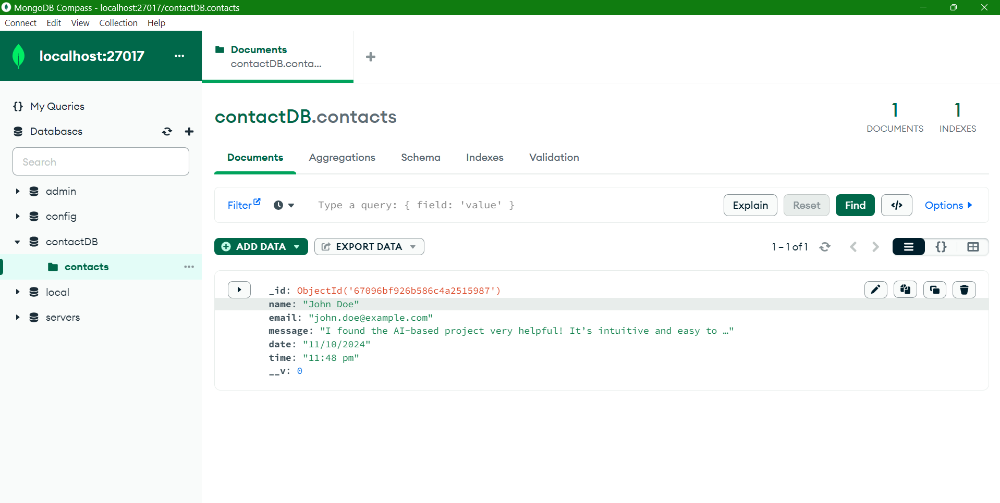

---

<div align="center">
  <p>
    <a href="https://github.com/VaibhavDaveDev/Explainable-AI-Based-Glaucoma-Detection-using-Transfer-Learning-LIME-and-LLMs/stargazers">⭐ Star this repo</a> •
    <a href="https://github.com/VaibhavDaveDev/Explainable-AI-Based-Glaucoma-Detection-using-Transfer-Learning-LIME-and-LLMs/issues/new">🐛 Report bug</a> •
    <a href="https://github.com/VaibhavDaveDev/Explainable-AI-Based-Glaucoma-Detection-using-Transfer-Learning-LIME-and-LLMs/issues/new">✨ Request feature</a>
  </p>
</div>
